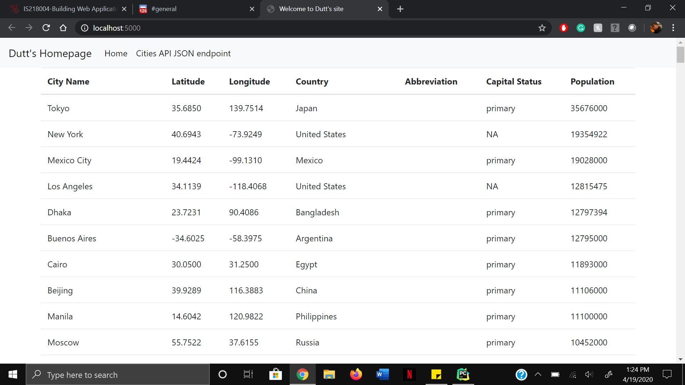
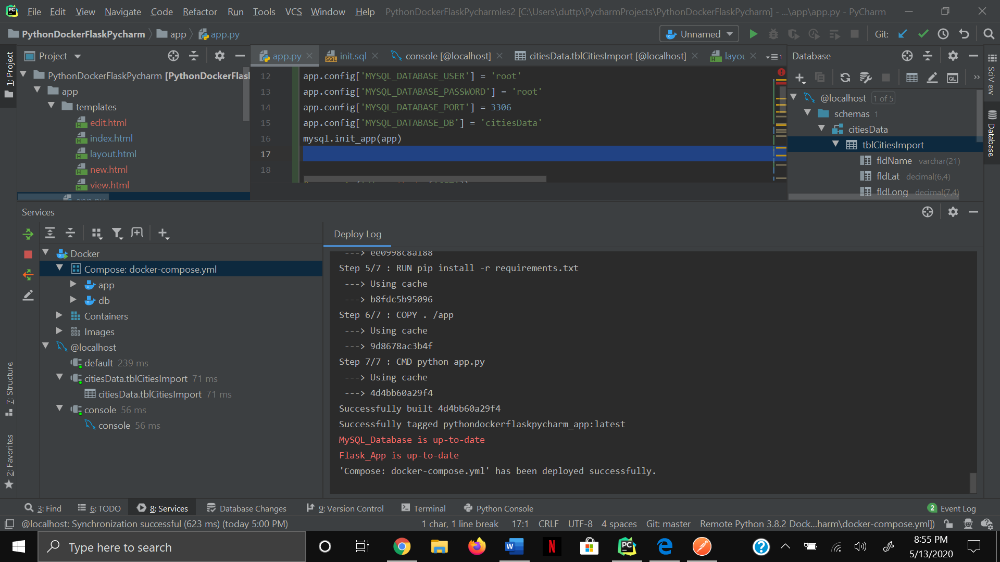
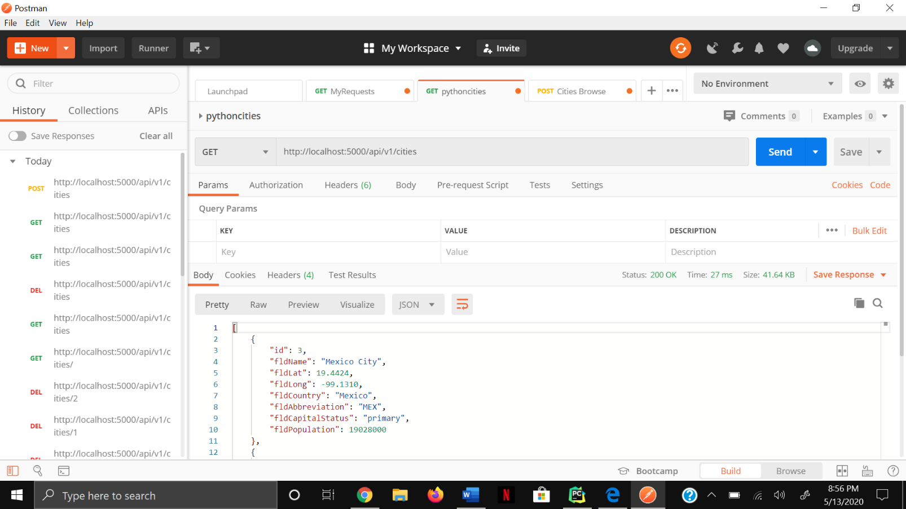
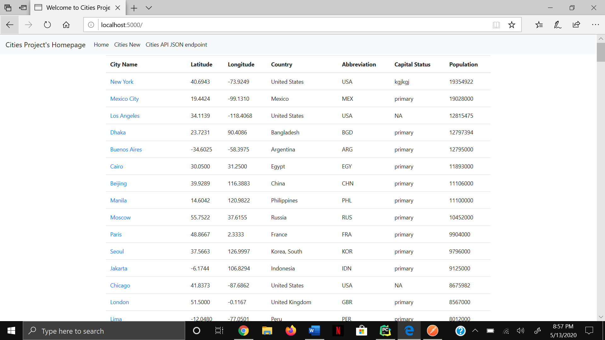
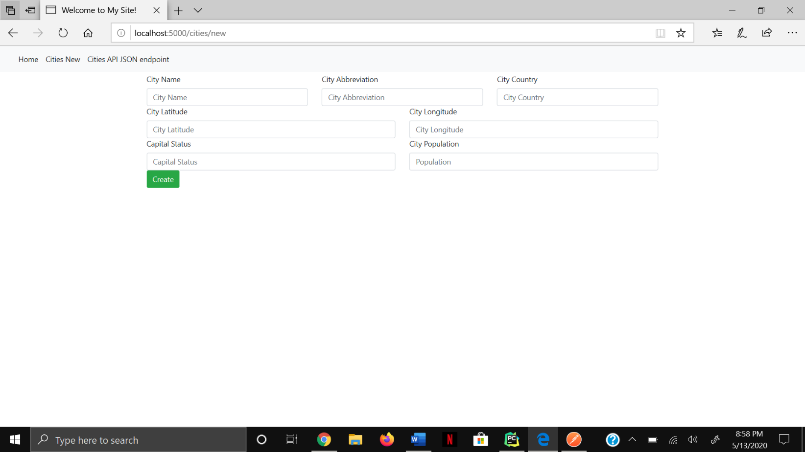
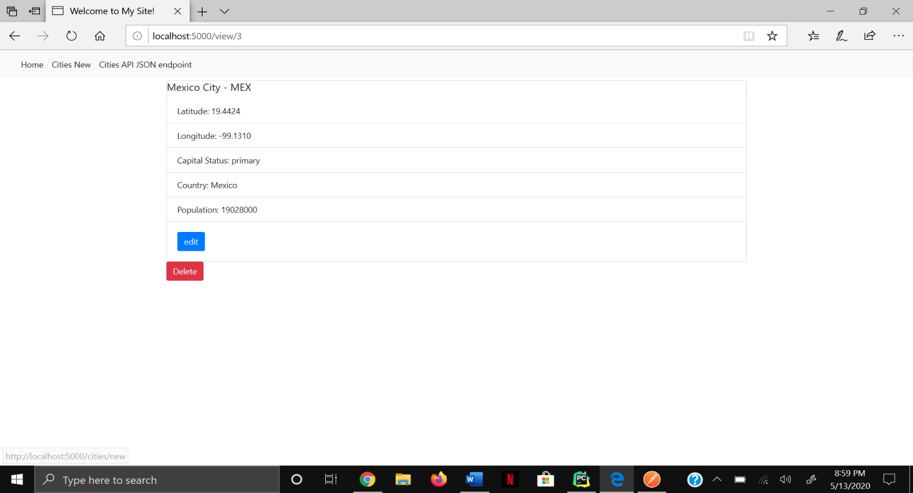
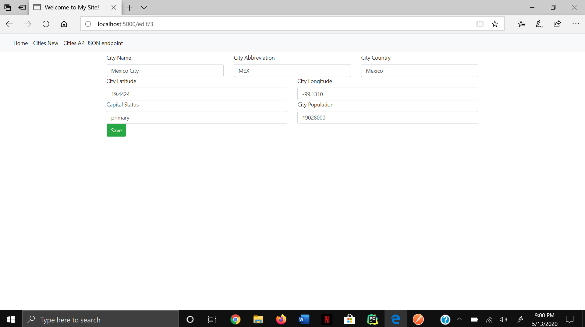
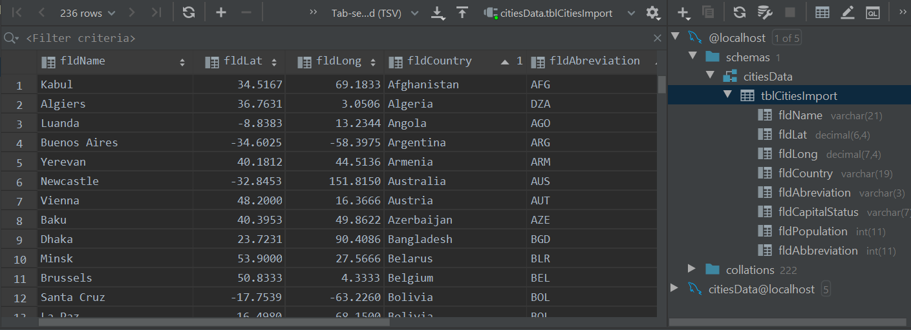
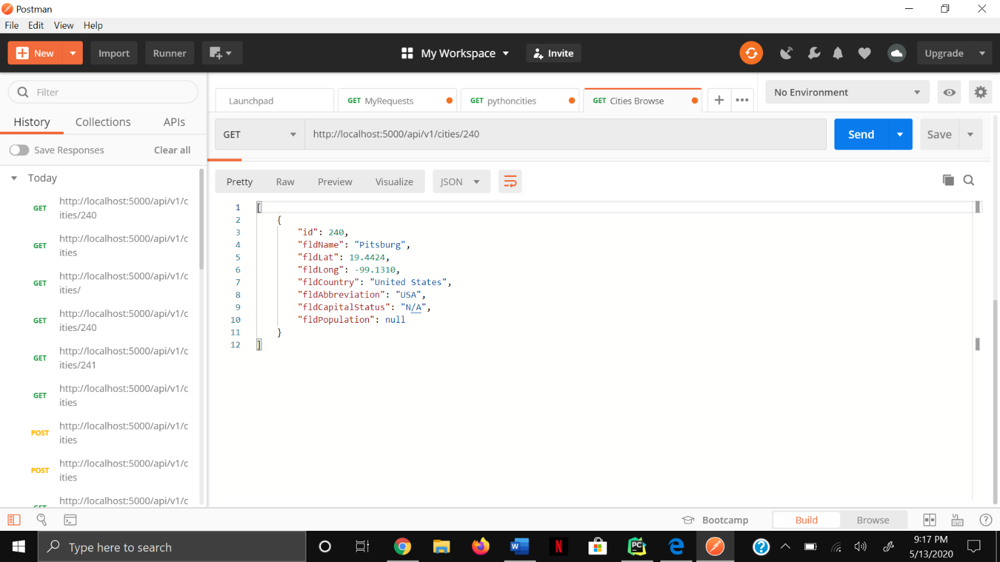
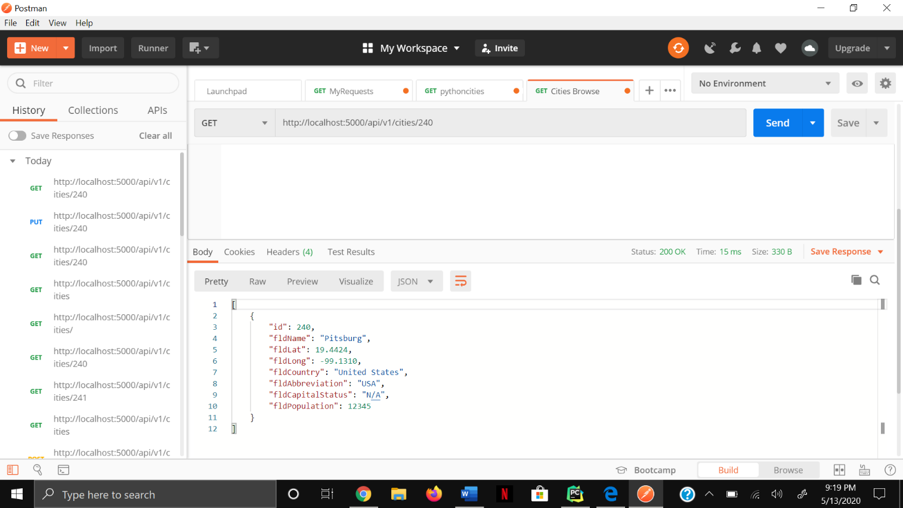

# Project Description
This project is a homework assignment to teach how to get Pycharm setup with Docker, Flask, MySQL, and Postman

[Download Assignment PDF Here](PPFSQL-Homework.pdf)

[View Assignment Video Here](https://youtu.be/QbMWNgrfAFg)

# SQL Data Screenshots

# Postman Screenshot

# Website Screenshot

# Final Project

